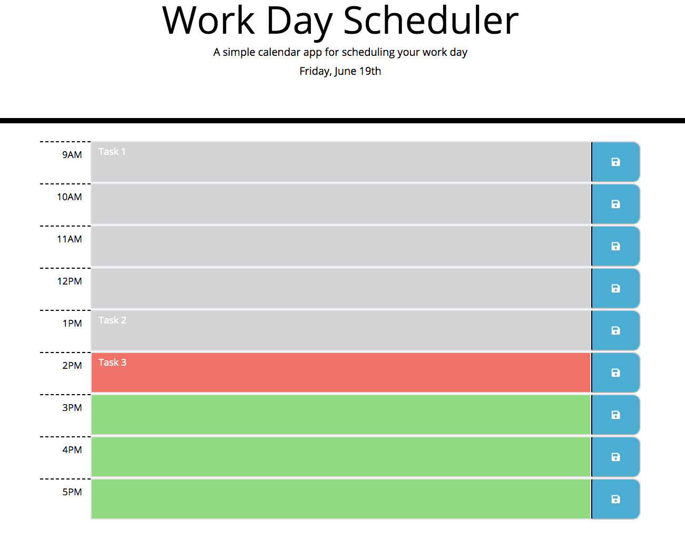

# Work Day Scheduler Starter Code

__*Live URL:*__ https://shhu21.github.io/scheduler/

# Table of Contents

# Objective
Following the given mock-up, create a work day scheduler.

# Assumptions

# Global Variables

## times
__Data Type:__ Array[String].  
__Purpose:__ Contains the hour time strings.  

## currentHour
__Data Type:__ String.  
__Purpose:__ Current hour string.  

## save
__Data Type:__ Function.  
__Purpose:__ 

# Functions

## setHour
__Parameters:__ None.  
__Return Type:__   
__Purpose:__   
__Functionality:__   

## createElements
__Parameters:__ None.  
__Return Type:__   
__Purpose:__   
__Functionality:__   

# Mock Up

# Website Preview

